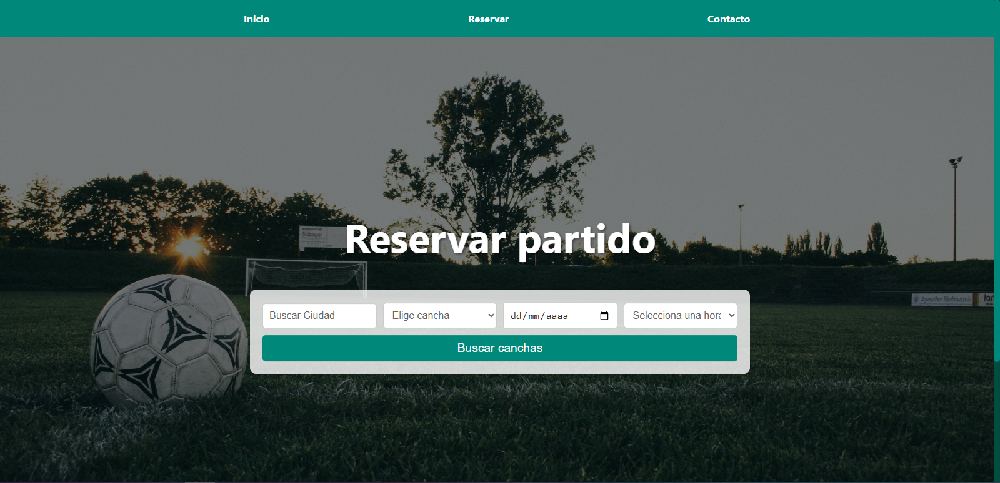
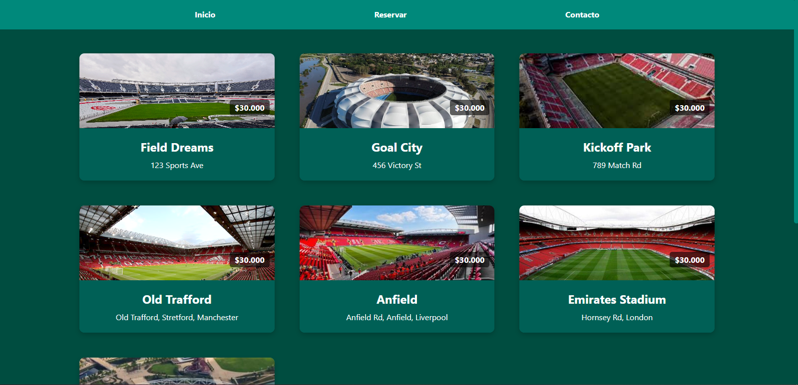
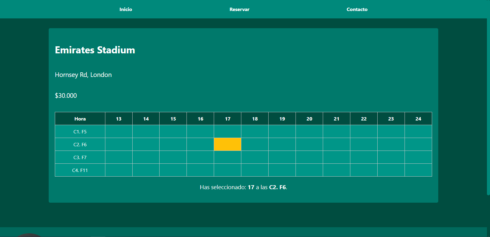

# Picadito ⚽

Picadito es una plataforma web para la reserva online de canchas y complejos deportivos. Permite a los usuarios buscar, seleccionar y reservar canchas fácilmente desde cualquier dispositivo.

## 🌐 Repositorio Backend

👉 [picadito-backend](https://github.com/lucasmaggi03/picadito-backend)

## 🚀 Tecnologías Utilizadas

- React
- TypeScript
- Node.js
- MySQL
- Axios
- React Router

## 🖼️ Características

- Autenticación de usuarios
- Búsqueda y visualización de canchas disponibles
- Reserva de turnos con horarios específicos
- Panel de administrador para gestión de complejos
- UI responsiva y amigable

## 🔧 Instalación

1. Clona el repositorio:

```bash
git clone https://github.com/lucasmaggi03/picadito-frontend.git
cd picadito-frontend
```

2. Instala las dependencias:

```bash
npm install
```

3. Configura las variables de entorno si es necesario (`.env`).

4. Inicia la aplicación:

```bash
npm run dev
```

## 📸 Capturas





## 🤝 Contribuciones

¡Las contribuciones son bienvenidas! Por favor, abre un issue o haz un fork del proyecto para proponer mejoras.

---
Desarrollado con por Lucas Maggi.
